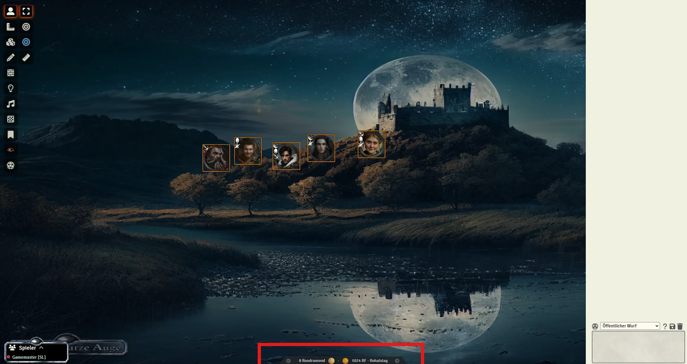
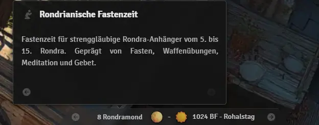

# DSA5 Aventurian Calendar

A complete calendar system for "Das Schwarze Auge" (The Dark Eye) RPG in FoundryVTT with real-time synchronization.

## Images

## Features

- **Complete DSA Calendar** - All 12 god months plus 5 Nameless Days
- **Holiday System** - 140+ Aventurian holidays with detailed tooltips
- **Real-time Sync** - GM & Player changes instantly appear for all players
- **Dynamic Elements** - Moon phases, seasons, and weekdays
- **Atmospheric Effects** - Special fog effect during Nameless Days
- **Multilingual** - German and English support

## Installation

You can use the FoundryVTT module store or

1. Open FoundryVTT **Add-on Modules**
2. Click **Install Module**
3. Paste manifest URL: `[https://raw.githubusercontent.com/xerberde/e9l-dsa5-aventurian-calendar/refs/heads/main/module.json]`
4. Enable in **Manage Modules**

## Usage

### Navigation

- **Click**: ±1 Day
- **Shift + Click**: ±1 Month
- **Ctrl + Click**: ±1 Year

### Holiday Tooltips

- **Hover** over the date to see holidays
- Navigate between multiple holidays with arrow buttons
- Shows holiday type (religious/worldly) and description
- Includes all canonical DSA holidays and festivals

## DSA Calendar System

- **12 Months** of 30 days each
- **5 Nameless Days** at year end
- **7-Day Week** with Aventurian weekdays
- **28-Day Lunar Cycle** with 8 moon phases
- **4 Seasons** with dynamic symbols
- **140+ Holidays** from official DSA lore

## Requirements

- **FoundryVTT**: v12+
- **Sockets**: Enabled for synchronization

